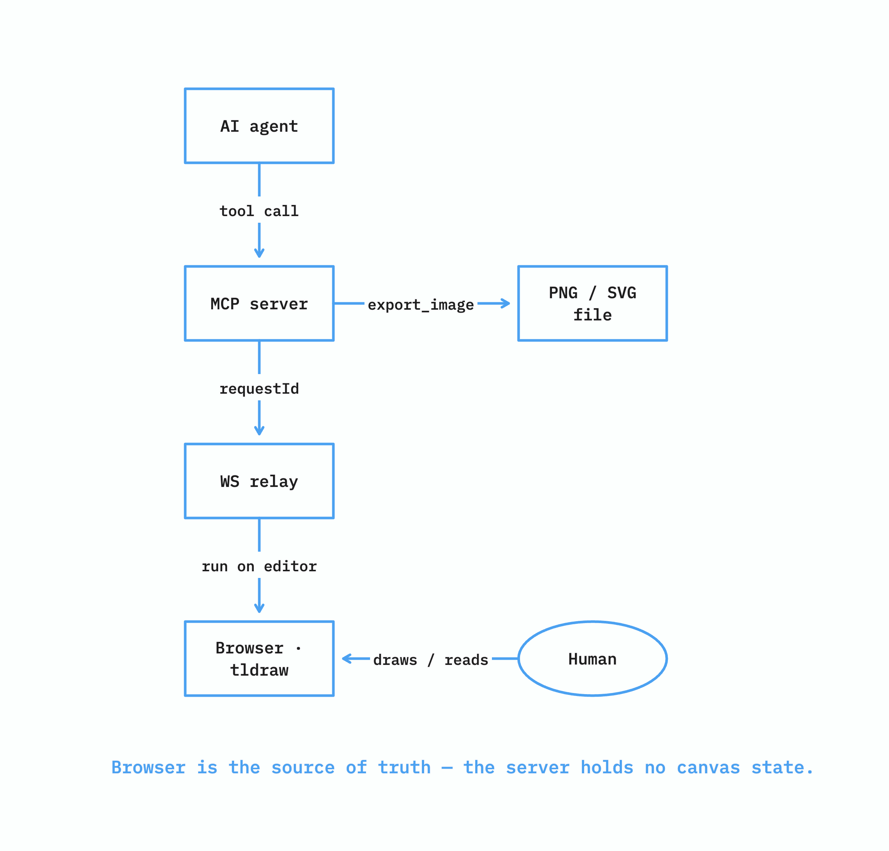

# endgame-canvas

A localhost [tldraw](https://tldraw.dev) canvas exposed over **MCP** — a shared visual medium
where an AI agent and a human draw and read the same canvas to align understanding and produce
diagrams, right from a chat.



> **The diagram above was not made in a design tool.** An AI agent drew it directly on the
> canvas using endgame-canvas's own MCP tools (`create_frame`, `create_flowchart`,
> `create_shape`, `create_arrow`, `create_note`, `export_image`), then exported it to the PNG
> you're looking at — from this prompt:
>
> > *"Draw this system's architecture on the canvas as a top-down flow: an AI agent makes a
> > tool call to the MCP server, which forwards it by requestId to the WebSocket relay, which
> > runs it on the browser's tldraw editor. To the side, show the agent exporting the canvas to
> > a PNG/SVG file, and a human drawing and reading the same canvas. Caption it: the browser is
> > the source of truth — the server holds no canvas state."*
>
> The boxes are blue because that's the agent's attribution colour — the canvas colours each
> agent's shapes so a human can see, at a glance, who drew what.

## Why

Chat is linear; understanding often isn't. endgame-canvas gives an agent a real 2D surface it
can both **read** and **draw on** — including a human's freehand strokes. The agent can read a
scribbled note, tell which shape a hand-drawn circle encloses, connect boxes with bound arrows,
lay out a flowchart in one call, and export the result to a file you can drop into a document.

## What it can do

21 MCP tools over one canvas:

- **Read** — `read_canvas` (a raster the agent can read freehand off), `get_snapshot` (every
  shape with position + text), `read_frame` (a frame cropped to a raster **plus** its shapes and
  their arrow bindings).
- **Draw** — `create_shape` (rectangle / ellipse / text + triangle, diamond, star, hexagon,
  cloud, x-box, check-box), `create_line`, `create_highlight`, `create_arrow` (bound to both
  shapes), `create_note`.
- **Frames** — `create_frame`, `list_frames` — a named frame is the shared reference unit
  ("what's in frame X?").
- **Edit** — `update_shape` (move / resize / relabel / recolour), `delete_shape`.
- **Navigate** — `zoom_to_frame`, `select` — point the human's view and highlight shapes.
- **Compose** — `create_flowchart` (nodes + bound arrows + tree/grid layout in one call),
  `create_connected`.
- **Pages** — `create_page`, `list_pages`, `switch_page`.
- **Export** — `export_image` writes a PNG or SVG **to disk**, so diagrams land in your docs.
- **Attribution** — `list_agents`; set `CANVAS_AGENT` and an agent's shapes take a distinct
  colour.

## Quickstart

Requires [Bun](https://bun.sh).

```bash
bun install
bun run start      # runs the WS relay (:9910) + Vite (:5173) in one terminal
```

Open **http://localhost:5173** and leave the tab open — that tab is the canvas.

Then register the MCP server with your client. For Claude Desktop / Claude Code, add to the MCP
config:

```json
{
  "mcpServers": {
    "endgame-canvas": {
      "command": "bun",
      "args": ["/absolute/path/to/endgame-canvas/src/server.ts"],
      "env": { "CANVAS_AGENT": "claude" }
    }
  }
}
```

`CANVAS_AGENT` is optional — set it to give this agent a distinct colour on the canvas; omit it
to draw in the default style. Now ask the agent to read or draw, and watch the tab.

## How it works

The **browser tldraw editor is the source of truth.** The MCP server holds no canvas state —
every tool is a command the browser runs on the live editor, correlated by `requestId`. That is
what makes reading a human's freehand strokes possible: the strokes live in the browser, and the
agent asks the browser about them. `export_image` is the one thing that lands server-side — the
browser renders the image and the server writes the file.

The WS relay (`:9910`) routes each response back to its caller only, never broadcasting. It is
hardened for real use: it rejects in-flight calls when a socket drops, reconnects with backoff so
a relay restart doesn't kill the agent, guards against malformed frames, and enforces a
single-browser policy (a new tab takes over; the old one is told, via close code `4001`, to stop
reconnecting). The canvas supports **one human and one agent, one browser.**

## Development

`bun run start` is the one-command dev stack (relay + Vite, auto-freeing stale ports, clean
Ctrl-C). The pieces also run on their own: `bun run relay`, `bun run dev`, `bun run server`.
`bun test` runs the suite.

Adding a tool is one `TOOL_DEFS` entry + one handler in `createDispatcher` (`src/server.ts`) +
one branch in `runTool` (`browser/src/main.tsx`) + a handler unit test.

## Stack

Bun (runtime / package manager / test) · tldraw + React + Vite (browser app) ·
`@modelcontextprotocol/sdk` (stdio MCP) · native `Bun.serve` WebSocket relay. No build step.

## License

[MIT](LICENSE).
